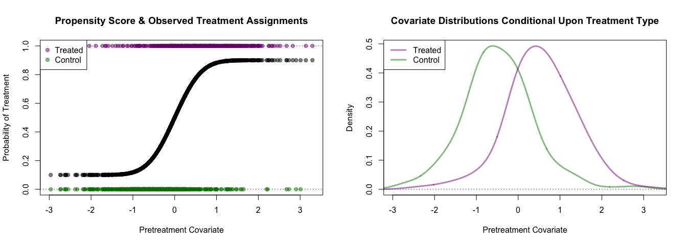

`gpbalancer`: an `R` Package for Optimally Balanced Gaussian Process Propensity Score Estimation
================================================================================================

Reference forthcoming...

Installing `gpbalancer`
-----------------------

The package `devtools` is required to install this `R` package from this Github repository. Install this package first if it is not already installed.

``` r
install.packages('devtools', dependencies = TRUE)
```

Once that package has been installed, use the following to install `gpbalancer`

``` r
devtools::install_github('bvegetabile/gpbalancer')
```

Load the package to begin analysis!

``` r
library('gpbalancer')
```

Example using `gpbalancer`
--------------------------

### Simulating data

Provided below is a simple simulation to explore the effectiveness of the optimally balanced Gaussian process propensity score. Consider a continuous covariate *X* which is used to assign treatment, let

*X*<sub>*i*</sub> ∼ *N*(0, 1)

Additionally, let the true propensity score be defined as follows,

*e*(*X*<sub>*i*</sub>)=Pr(*T*<sub>*i*</sub> = 1|*X*<sub>*i*</sub>)=0.9 × *Φ*(2 \* *X*<sub>*i*</sub>)+0.05

where *Φ*(⋅) is the cumulative distribution of the Normal Distribution. Finally, we simulate treatment assignment such that,

*T*<sub>*i*</sub>|*X*<sub>*i*</sub> ∼ *B**e**r**n**o**u**l**l**i*( *e*(*X*<sub>*i*</sub>) )

Additionally, we will consider the following potential outcomes

*Y*<sub>*i*</sub><sup>*T* = 1</sup> = *X*<sup>2</sup> + 2 + *ϵ*<sub>*i*, 𝒯</sub>

*Y*<sub>*i*</sub><sup>*T* = 0</sup> = *X* + *ϵ*<sub>*i*, 𝒞</sub>

where *ϵ*<sub>*i*, *G*</sub> ∼ *N*(0, 0.25<sup>2</sup>) for *G* ∈ {𝒯, 𝒞}. The observed outcome will be,

*Y*<sub>*i*</sub><sup>*o**b**s*</sup> = *I*(*T*<sub>*i*</sub> = 1)*Y*<sub>*i*</sub><sup>*T* = 1</sup> + *I*(*T* = 0)*Y*<sub>*i*</sub><sup>*T* = 0</sup>

``` r
set.seed(201711)
n_obs <- 500
pretreatment_cov <- rnorm(n_obs)
prop_score <- 0.9 * pnorm(2*pretreatment_cov) + 0.05
treatment_assignment <- rbinom(n_obs, size = 1, prob = prop_score)
y_t <- pretreatment_cov^2 + 2 + rnorm(n_obs, sd=0.25)
y_c <- pretreatment_cov + rnorm(n_obs, sd=0.25)
y_obs <- treatment_assignment * y_t + (1-treatment_assignment) * y_c

t_col <- rgb(0.5,0,0.5,0.5)
c_col <- rgb(0,0.5,0,0.5)
```

### Visualizing the Propensity Score & Covariate Imbalance

The true propensity score and observed treatment assignments are shown below.

``` r
par(mfrow=c(1,2))
plot(pretreatment_cov, prop_score, 
     xlim=range(pretreatment_cov), 
     ylim=c(0,1),
     pch=19, col=rgb(0,0,0,0.5),
     xlab='Pretreatment Covariate',
     ylab='Probability of Treatment',
     main='Propensity Score & Observed Treatment Assignments')
points(pretreatment_cov[as.logical(treatment_assignment)],
       treatment_assignment[as.logical(treatment_assignment)],
       pch=19, col=t_col)
points(pretreatment_cov[!as.logical(treatment_assignment)],
       treatment_assignment[!as.logical(treatment_assignment)],
       pch=19, col=c_col)
abline(h=c(0,1), lty=3)
legend('topleft', c('Treated', 'Control'), pch=19, col=c(t_col, c_col), bg='white')

plot(density(pretreatment_cov[!as.logical(treatment_assignment)], adjust = 1.5),
     xlim=range(pretreatment_cov), 
     type='l', lwd=3, col=c_col,
     xlab='Pretreatment Covariate',
     ylab='Density',
     main='Covariate Distributions Conditional Upon Treatment Type')
lines(density(pretreatment_cov[as.logical(treatment_assignment)], adjust = 1.5),
     lwd=3, col=t_col)
abline(h=c(0,1), lty=3)
legend('topleft', c('Treated', 'Control'), lty=1, lwd=3, col=c(t_col, c_col), bg='white')
```


