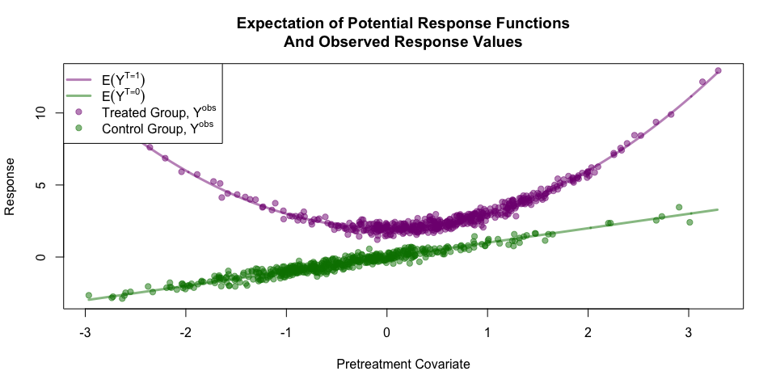
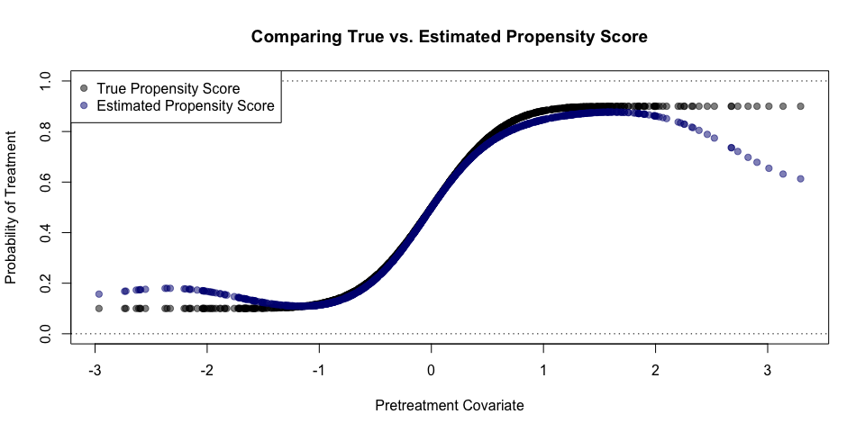

`gpbalancer`: an `R` Package for Optimally Balanced Gaussian Process Propensity Score Estimation
================================================================================================

Reference forthcoming...

Installing `gpbalancer`
-----------------------

The package `devtools` is required to install this `R` package from this Github repository. Install this package first if it is not already installed.

``` r
install.packages('devtools', dependencies = TRUE)
```

Once that package has been installed, use the following to install `gpbalancer`

``` r
devtools::install_github('bvegetabile/gpbalancer')
```

Load the package to begin analysis!

``` r
library('gpbalancer')
```

Example using `gpbalancer`
--------------------------

### Simulating data

Provided below is a simple simulation to explore the effectiveness of the optimally balanced Gaussian process propensity score. Consider a continuous covariate *X* which is used to assign treatment, for *i* ∈ 1, …, 500 let,

*X*<sub>*i*</sub> ∼ *N*(0, 1)

Additionally, let the true propensity score be defined as follows,

*e*(*X*<sub>*i*</sub>)=Pr(*T*<sub>*i*</sub> = 1|*X*<sub>*i*</sub>)=0.8 × *Φ*(2 \* *X*<sub>*i*</sub>)+0.1

where *Φ*(⋅) is the cumulative distribution of the Normal Distribution. Finally, we simulate treatment assignment such that,

*T*<sub>*i*</sub>|*X*<sub>*i*</sub> ∼ *B**e**r**n**o**u**l**l**i*( *e*(*X*<sub>*i*</sub>) )

Additionally, we will consider the following potential outcomes

*Y*<sub>*i*</sub><sup>*T* = 1</sup> = *X*<sub>*i*</sub><sup>2</sup> + 2 + *ϵ*<sub>*i*, 𝒯</sub>

*Y*<sub>*i*</sub><sup>*T* = 0</sup> = *X*<sub>*i*</sub> + *ϵ*<sub>*i*, 𝒞</sub>

where *ϵ*<sub>*i*, *G*</sub> ∼ *N*(0, 0.25<sup>2</sup>) for *G* ∈ {𝒯, 𝒞}. The observed outcome will be,

*Y*<sub>*i*</sub><sup>*o**b**s*</sup> = *I*(*T*<sub>*i*</sub> = 1)*Y*<sub>*i*</sub><sup>*T* = 1</sup> + *I*(*T* = 0)*Y*<sub>*i*</sub><sup>*T* = 0</sup>

``` r
set.seed(201711)
n_obs <- 500
pretreatment_cov <- rnorm(n_obs)
prop_score <- 0.8 * pnorm(2*pretreatment_cov) + 0.1
treatment_assignment <- rbinom(n_obs, size = 1, prob = prop_score)
ta_logical <- as.logical(treatment_assignment)
y_t <- pretreatment_cov^2 + 2 + rnorm(n_obs, sd=0.25)
y_c <- pretreatment_cov + rnorm(n_obs, sd=0.25)
y_obs <- treatment_assignment * y_t + (1-treatment_assignment) * y_c

t_col <- rgb(0.5,0,0.5,0.5)
c_col <- rgb(0,0.5,0,0.5)
```

### Visualizing the Propensity Score & Covariate Imbalance

The true propensity score and observed treatment assignments are shown below.

``` r
par(mfrow=c(1,2))
plot(pretreatment_cov, prop_score, 
     xlim=range(pretreatment_cov), 
     ylim=c(0,1),
     pch=19, col=rgb(0,0,0,0.5),
     xlab='Pretreatment Covariate',
     ylab='Probability of Treatment',
     main='Propensity Score & Observed Treatment Assignments')
points(pretreatment_cov[ta_logical],
       treatment_assignment[ta_logical],
       pch=19, col=t_col)
points(pretreatment_cov[!ta_logical],
       treatment_assignment[!ta_logical],
       pch=19, col=c_col)
abline(h=c(0,1), lty=3)
legend('topleft', c('Treated', 'Control'), pch=19, col=c(t_col, c_col), bg='white')

plot(density(pretreatment_cov[!ta_logical], adjust = 1.5),
     xlim=range(pretreatment_cov), 
     type='l', lwd=3, col=c_col,
     xlab='Pretreatment Covariate',
     ylab='Density',
     main='Covariate Distributions Conditional Upon Treatment Type')
lines(density(pretreatment_cov[ta_logical], adjust = 1.5),
     lwd=3, col=t_col)
abline(h=c(0,1), lty=3)
legend('topleft', c('Treated', 'Control'), lty=1, lwd=3, col=c(t_col, c_col), bg='white')
```


``` r
knitr::kable(gpbalancer::bal_table(data.frame("Pretreatment Covariate" = pretreatment_cov), 1, ta_logical))
```

|                        |   NT|   MeanT|    VarT|   NC|    MeanC|    VarC|  StdDiff|  LogRatio|
|------------------------|----:|-------:|-------:|----:|--------:|-------:|--------:|---------:|
| Pretreatment.Covariate |  246|  0.6051|  0.6356|  254|  -0.5894|  0.6911|   1.4667|   -0.0419|

### Visualizing the Potential Outcomes & Observed Responses

Below are visualizations of the expectations of the potential response functions and the observed responses for the sample data.

``` r
exes <- seq(min(pretreatment_cov), 
            max(pretreatment_cov), 
            0.01)
meanYT <- exes^2 + 2
meanYC <- exes
ylims <- range(cbind(meanYT, meanYC))

plot(exes, meanYT,
     type='l', lwd=3, col = t_col,
     xlim=range(pretreatment_cov), ylim=ylims,
     xlab='Pretreatment Covariate',
     ylab='Response',
     main='Expectation of Potential Response Functions\nAnd Observed Response Values')
lines(exes, meanYC, lwd=3, col = c_col)
points(pretreatment_cov[ta_logical], y_obs[ta_logical], pch=19, col=t_col)
points(pretreatment_cov[!ta_logical], y_obs[!ta_logical], pch=19, col=c_col)
legend('topleft', 
       c(expression(E(Y^{T==1})), 
         expression(E(Y^{T==0})),
         expression(paste('Treated Group, ', Y^{obs})), 
         expression(paste('Control Group, ', Y^{obs}))), 
       lty=c(1,1,NA,NA), lwd=c(3,3,NA,NA), pch=c(NA, NA, 19, 19), col=c(t_col, c_col), bg='white')
```



Under these settings if we are attempting to model *τ* = *E*(*Y*<sup>*T* = 1</sup> − *Y*<sup>*T* = 0</sup>) without adjustment (i.e. using *E*(*Y*<sup>*o**b**s*</sup>|*T* = 1)−*E*(*Y*<sup>*o**b**s*</sup>|*T* = 0)), then the bias would be approximately 0.6.

``` r
hat_tau <- mean(y_obs[ta_logical]) - mean(y_obs[!ta_logical])
original_bias <- (hat_tau-3)
message('Orignal Bias: ', round(original_bias,3))
```

    ## Orignal Bias: 0.56

### Estimating the Propensity Score

Using the above simulated data, we can now estimate the propensity score. The reported time is in seconds:

``` r
est_propscore <- gpbalancer::gpbal(X = as.matrix(pretreatment_cov), 
                                   y = treatment_assignment, 
                                   init_theta = c(1),
                                   cov_function = gpbalancer::sqexp_par,
                                   verbose = T)
```

    ## Starting Optimization  @   2017-11-21 11:52:45

    ## Finished Optimization  @   2017-11-21 11:52:47

    ## Time Difference          : 1.7494

    ## Optimal Covariate Balance: 0.00223105

#### Visualizing the Estimated Propensity Score

``` r
plot(pretreatment_cov, prop_score, 
     xlim=range(pretreatment_cov), 
     ylim=c(0,1),
     pch=19, col=rgb(0,0,0,0.5),
     xlab='Pretreatment Covariate',
     ylab='Probability of Treatment',
     main='Comparing True vs. Estimated Propensity Score')
points(pretreatment_cov,
       est_propscore$ps,
       pch=19, col=rgb(0,0,0.5,0.5))
abline(h=c(0,1), lty=3)
legend('topleft', c('True Propensity Score', 'Estimated Propensity Score'), pch=19, col=c(rgb(0,0,0,0.5), rgb(0,0,0.5,0.5)), bg='white')
```



#### Balance Adjusting for the True Propensity Score

``` r
true_wts <- ifelse(ta_logical, 1/prop_score, 1/(1-prop_score))
knitr::kable(gpbalancer::bal_table(data.frame("Pretreatment Covariate" = pretreatment_cov), 1, ta_logical, true_wts))
```

|                        |   NT|   MeanT|    VarT|   NC|  MeanC|    VarC|  StdDiff|  LogRatio|
|------------------------|----:|-------:|-------:|----:|------:|-------:|--------:|---------:|
| Pretreatment.Covariate |  246|  0.0932|  0.9112|  254|  0.022|  0.9779|   0.0733|   -0.0353|

#### Balance Adjusting for the Estimated Optimally Balanced Gaussian Process Propensity Score

``` r
est_wts <- ifelse(ta_logical, 1/est_propscore$ps, 1/(1-est_propscore$ps))
knitr::kable(gpbalancer::bal_table(data.frame("Pretreatment Covariate" = pretreatment_cov), 1, ta_logical, est_wts))
```

|                        |   NT|   MeanT|    VarT|   NC|   MeanC|    VarC|  StdDiff|  LogRatio|
|------------------------|----:|-------:|-------:|----:|-------:|-------:|--------:|---------:|
| Pretreatment.Covariate |  246|  0.0123|  1.0673|  254|  -0.011|  0.9828|   0.0231|    0.0412|

### Evaluating the Performance of the Optimally Balanced Gaussian Process Propensity Score

We now compare the method when there is no adjustment on the propensity score and when there is adjustment by the true propensity score. To compare these three scenarios the bias, the percent reduction in bias compared with no adjustment, and the mean squared error of the estimators are provided.
