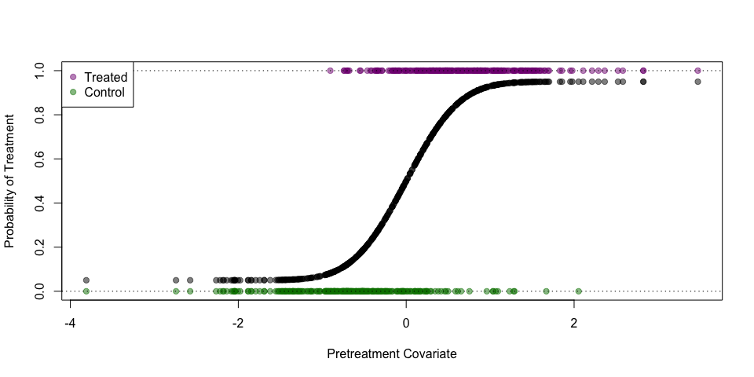

`gpbalancer`: an `R` Package for Optimally Balanced Gaussian Process Propensity Score Estimation
================================================================================================

Reference forthcoming...

Installing `gpbalancer`
-----------------------

The package `devtools` is required to install this `R` package from this Github repository. Install this package first if it is not already installed.

``` r
install.packages('devtools', dependencies = TRUE)
```

Once that package has been installed, use the following to install `gpbalancer`

``` r
devtools::install_github('bvegetabile/gpbalancer')
```

Load the package to begin analysis!

``` r
library('gpbalancer')
```

Example using `gpbalancer`
--------------------------

### Simulating data

``` r
set.seed(201711)
n_obs <- 500
pretreatment_cov <- rnorm(n_obs)
prop_score <- 0.9 * pnorm(2*pretreatment_cov) + 0.05
treatment_assignment <- rbinom(n_obs, size = 1, prob = prop_score)
t_col <- rgb(0.5,0,0.5,0.5)
c_col <- rgb(0,0.5,0,0.5)

plot(pretreatment_cov, prop_score, 
     xlim=range(pretreatment_cov), 
     ylim=c(0,1),
     pch=19, col=rgb(0,0,0,0.5),
     xlab='Pretreatment Covariate',
     ylab='Probability of Treatment')
points(pretreatment_cov[as.logical(treatment_assignment)],
       treatment_assignment[as.logical(treatment_assignment)],
       pch=19, col=t_col)
points(pretreatment_cov[!as.logical(treatment_assignment)],
       treatment_assignment[!as.logical(treatment_assignment)],
       pch=19, col=c_col)
abline(h=c(0,1), lty=3)
legend('topleft', c('Treated', 'Control'), pch=19, col=c(t_col, c_col), bg='white')
```


